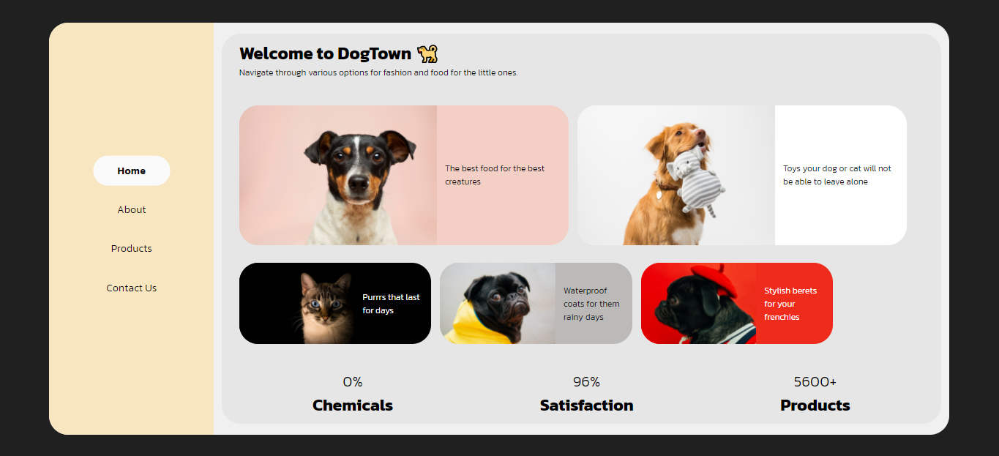

# Pet small e-Shop

>React, React Router and other techniques

________
### Preview

Notice: The purpose of this project was to play around with react router in general and how to show products under a clicked category in products. Therefore, not much care was given in the responsiveness of this project.

________
### Live preview of this project on Heroku: 

[https://pet-eshop-reactrouter.herokuapp.com/](https://pet-eshop-reactrouter.herokuapp.com/)

**or** 

### you can clone it locally and run:
##### `npm install`
To install all dependencies needed for this application.

##### `npm run start`

To run the app in the development mode.\
Open [http://localhost:3000](http://localhost:3000) to view it in the browser.
